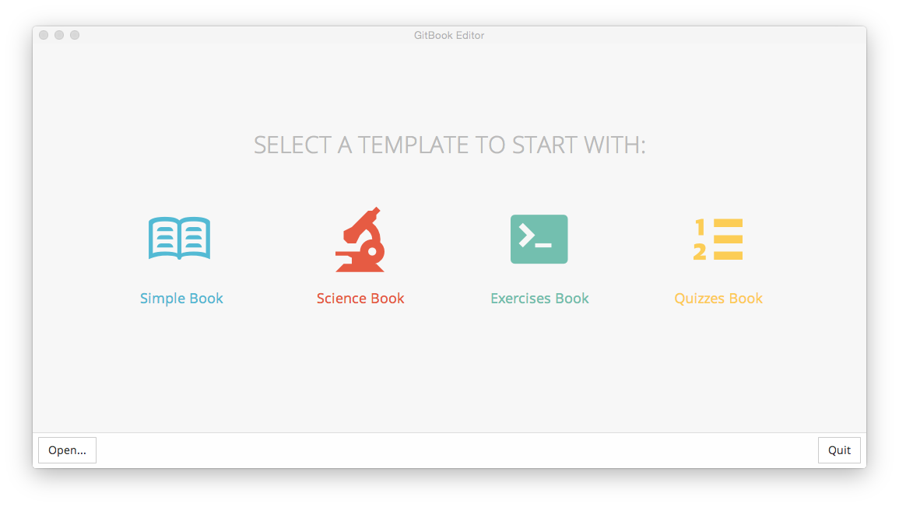

# wr-gitbook


## gitbook配置
### 默认插件

### book.json
``` js
{
    //标题
    "title": "Gitbook入门",

    //作者
    "author": "Wang Yuanwei <now_way@126.com>",
    
    //描述
    "description": "gitbook入门",

    //语言，简体中文zh-hans
    "language": "zh-hans",

    //需要load的插件
    "plugins": [

        //评论
        "disqus",

        //github似的锚点
        "anchors",

        //
        "multipart",

        //加载中文搜索需要移除默认的search插件
        "-search",
        "-lunr",
        "search-plus",

        //移除自带的分享按钮
        "-sharing",

        //左侧目录结构可伸缩
        "splitter",
        
        //将页面分块显示
        "sectionx",

        //为页面添加页脚
        "tbfed-pagefooter"
    ],
    "pluginsConfig": {
        "disqus": {
            "shortName": "wr-gitbook"
        },
        "tbfed-pagefooter": {
            "copyright": "Copyright &copy 2017",
            "modify_label": "最后修改时间：",
            "modify_format": "YYYY-MM-DD HH:mm:ss"
        }
    }
}


```