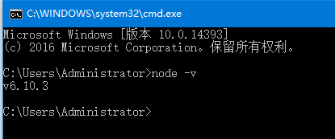

# 安装Node.js
- 官网下载对应的安装包,安装即可
>https://nodejs.org/zh-cn/

- 测试安装是否成功

查看版本：`node -v`

# 修改npm源
- 更换node镜像源（参考网址：http://npm.taobao.org/）

`npm install -g cnpm --registry=https://registry.npm.taobao.org`

